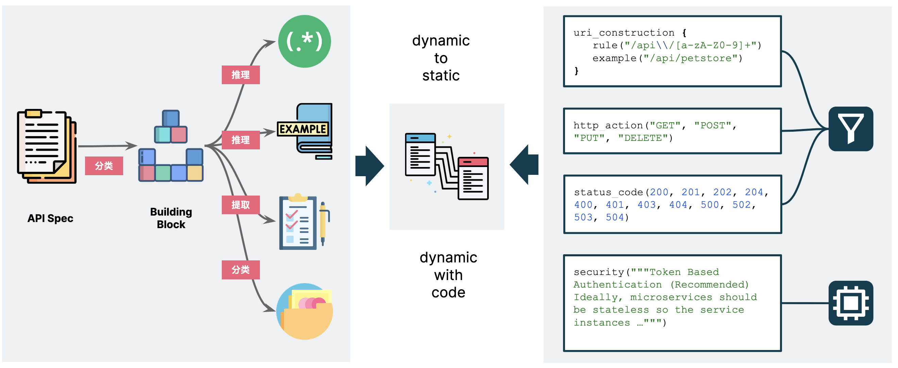
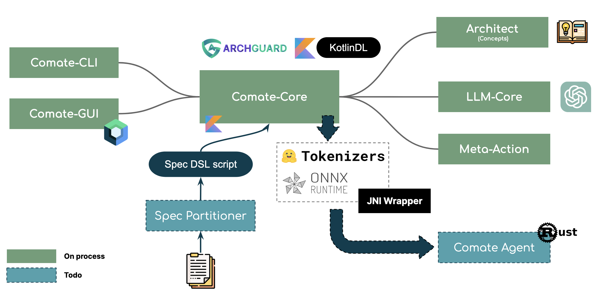

# 原子能力映射

在 ArchGuard Co-mate 中，对于 API 能力来说，我们做的一件事是**分解 API 文档**， **按不同 LLM 的原子能力进行分解**。构建出四种不同的原子能力：

- 推理出适用于 URI 的正则表达式。
- 推理出一个合理的 example。
- 提取一些 checklist，诸如于状态码、HTTP Action 等。
- 将剩下的不确定性内容，扔到一起。

如下图所示：



在右侧，我们则构建了一个 Kotlin Typesafe DSL，以动态的加载到系统中（未来），每一个函数对应到一个 Rule。

```kotlin
rest_api {
    uri_construction {
        rule("/api\\/[a-zA-Z0-9]+\\/v[0-9]+\\/[a-zA-Z0-9\\/\\-]+")
        example("/api/petstore/v1/pets/dogs")
    }

    http_action("GET", "POST", "PUT", "DELETE")
    status_code(200, 201, 202, 204, 400, 401, 403, 404, 500, 502, 503, 504)

    security("""Token Based Authentication (Recommended) Ideally, ...""")

    misc("""....""")
}
```

作为一个 demo，这个 DSL 依旧具备很大的完善空间。其中比较有意思的部分在于 security 和 misc 部分，这些不确定性正好适用于 LLM 进行推理。所以，在执行对应的 misc、security 规则检查时，会再调用  GPT 来检查：


以将其中的确定性与不确定性更好的结合，进而充分地利用了 LLM 与 ArchGuard 的能力，并减少对 GPT 的消耗。

## Welcome join us

下图是，当前 ArchGuard Co-mate 的所有模块：



简单介绍如下：

- Comate-Core 提供了 CLI 和 GUI 所需要的基本能力，
- Meta-Action 则是定义了基本的 Action
- Architecture 定义了什么是 Co-mate 理解的架构
- LLM-Core 则是对于 LLM 的调用 。
- Spec Partitioner 则是计划对于规范的提取与自动生成（当前都是手动 prompt）

而我们在采用 JVM 技术栈的时候，遇到了几个坑 KotlinDL 和 Deep Java Library 都是通过 JNI/Rust 的方式调用了 HuggingFace Tokenizers、ONNX API，导致了应用在 macOS 下 crash。而一种理想的方式应该是通过 JSON RPC 的方式来调用，所以我们计划使用 Rust 构建一个新的模块：Comate Agent。

所以，如果你对使用 JVM 技术栈来开发 AI 应用，对 Rust 技术栈来开发 AI 应用，欢迎来加入我们。

## 总结

该文介绍了 Thoughtworks 开源社区创建的一系列开源项目，探索了大语言模型与架构治理、架构设计的可能性。其中，ArchGuard Co-mate 是一个探索性的项目，旨在探索架构师助手的能力，包括本地语义分析、动态上下文收集 API、架构规范检查等。文章还介绍了分层架构与 ArchGuard 能力映射、LLM 与 Co-mate API 的能力映射等内容。