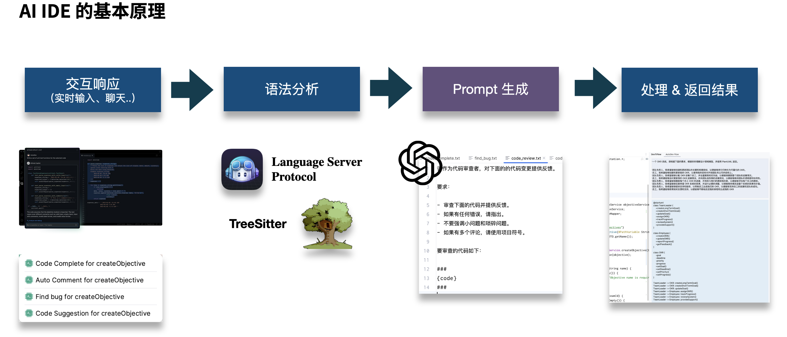

# AI + DevOps 最后一公里：AutoDev 插件

AI IDE 基本原理：没有魔法！全是 prompt! 🐶

> AutoDev 是一款高度自动化的 AI 辅助编程工具。AutoDev 能够与您的需求管理系统（例如
> Jira、Trello、Github Issue 等）直接对接。在 IDE 中，您只需简单点击，AutoDev
> 会根据您的需求自动为您生成代码。您所需做的，仅仅是对生成的代码进行质量检查。
>

简单来说，AutoDev 定位是适用于私有化大语言模型 + 高度集成的 AI 编程助手。AutoDev 提供了一种 AutoCRUD 模式，其设计理解的过程是：

1. 从需求管理系统获取需求，并进行需求分析。
2. 结合源码与需求系统，选择最适合变更的入口（如 Java 中的 Controller）
3. 将需求与 Controller 交给 AI 分析，以实现代码的代码。
4. 根据 Controller 逐步自动完成其它部分代码（实现中…）

另外一种模式则是普通的 Copilot 模式，可以接入现有的大模型工具，实现一系列的 AI 代码辅助相关功能。

GitHub： [https://github.com/unit-mesh/auto-dev](https://github.com/unit-mesh/auto-dev)

接入 LLM，我们不仅可以生成代码，还可以生成单元测试代码，从而提高测试效率和覆盖率。

让我们再展开看一看，基于现有的 AI 能力，会有哪些新可能性。

## 平台工程的变化与新机遇

而除了我们上述的 demo 之外，我们相信它带会其它带来一系列的变化。对于中大型组织的基础设施或者平台团队来说，要接入 AI
能力需要有更多的变化与机遇。

>
平台工程是一种用来构建和运维支持软件交付和生命周期管理的自助式内部开发者平台的机制和架构。平台工程可以提高开发者的体验和生产力，提供自动化的基础设施操作。
平台工程是软件工程组织的新趋势，它可以优化开发者的工作流程，加速产品团队交付客户价值。

平台工程的核心思想是将平台视为一种产品，由专业的平台团队来创建和维护，为内部的客户（如开发者、数据科学家等）提供可复用的服务、组件和工具。

## 需求：自动化收敛、分析与完善

在现有的场景之下，已经有一系列的关于结合 AI 进行需求管理的尝试：

- 自动化完善。对用户的反馈和数据的分析，自动识别和补充缺失的需求信息，例如自动识别用户提出的问题并转化为需求描述，自动补全需求的关键词和标签等。
- 自动化分析。通过训练自带的领域知识，可以更好地评估和优化需求，发现潜在的问题和机会，提高需求的效率和效果。
- 自动化收敛。结合其它 AI 技术，比如智能推荐、对话系统、多方协作等，可以帮助您更好地沟通和协调需求，收集和整合用户的反馈和痛点，提高需求的满意度和一致性。
- 自动化迭代。结合人类反馈的 AI 数据，可以更好地更新和改进需求生成，适应不断变化的环境和用户需求，提高需求的持续性和创新性

尽管现有的几个方案：LangChain、llama-index 等暂时只支持 OpenAI，但是随着更多开源大语言模型的加入，未来会更易于落地。

## 工具链：智能的 IDE

对于现有的场景来说，已经相当的丰富，诸如于：

- 自动化代码审查
- 自动化测试
- 自动化日志分析
- AI 辅助编程
- ……

诚然，诸如于 GitHub Copilot 等收费 AI
工具来说，对于大部分公司来说，贵可能是其次，重点是代码的安全性。而虽然国内各类新的模型层出不穷，但是大部分缺少编程相关的集成，又或者是编程能力比较弱。
然而，市面上也有只用于编程相关的模型，如
Salesforce 在 Hugging Face 上提供的 16B CodeGen 模型。虽然，还需要经过一些小的微调，但是如 Replit 公司所言，效果还是非常不错的。

随后，便是类似于 AutoDev 针对于大语言模型进行的封装，简化普通开发人员的开发过程。

## 文档：超越搜索

在有了 LLM 和各种智能问答的基础上，我们还可以加入内部各种工具的文档和代码，以提供更全面、更智能的文档服务。例如，LangChain
构建的问答式文档，可以对企业内部的各种文档进行语义理解和智能问答，进而简化开发人员的学习成本。
