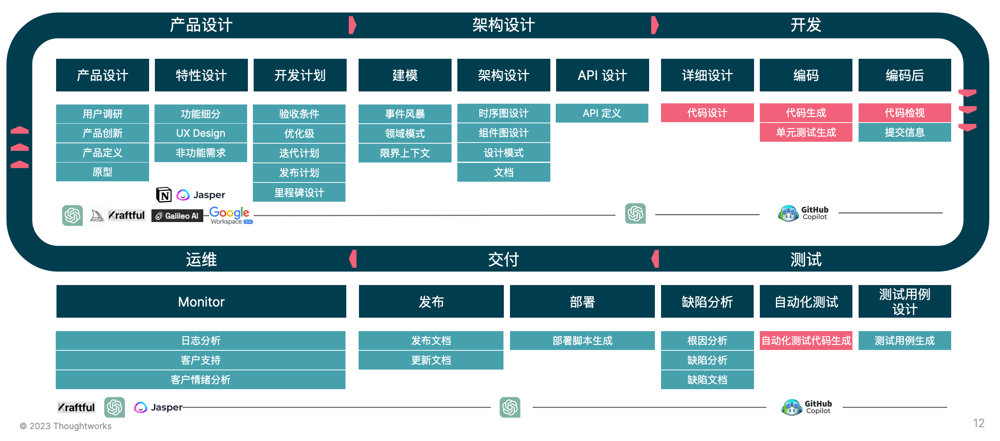

# LLM 应用开发模式：精细化流程

一个结合 AI 的自动化的工作流应该包含四个要素：

- 场景模板化，即预设各种常见的工作场景，为用户提供快捷的开始工作的方式。
- 交互式环境，包括但不限于输入框、按钮、编辑器、错误信息、帮助文档等，使用户能够与系统进行交互和反馈。
- 格式化输出，为用户提供规范的输出结果，避免信息过载或无用信息。
- 流程与工具集成，将不同的工具和流程集成到一个自动化的流程中，提高工作效率和准确性。同时，通过 AI 技术的支持，让系统能够智能化地处理数据和信息，进一步提高工作效率和准确性。

简单来说，就是我们依旧需要碳基生物作为检查官，来检查硅基生物输出是否合理？

## 设计构建高质量流程

基于我们对 ChatGPT 的使用经验，我们建议在使用 ChatGPT 之前，先考虑如何设计高质量的流程。这里的高质量流程，指的是：

- 明确的目标和目的：高质量的流程应该有明确的目标和目的，确保流程的设计和执行都能够达成预期的结果。 
- 易于理解和操作：高质量的流程应该简单易懂，让执行者能够轻松理解并操作。流程的设计应该尽可能避免复杂的步骤和冗长的说明，以免造成执行者的困惑和错误。
- 明确的责任和角色：高质量的流程应该明确各个执行者的责任和角色，避免执行者的混淆和错误。流程设计者应该明确各个角色的职责和权限，确保流程的顺利执行。
- 可度量和评估：高质量的流程应该能够被度量和评估。流程设计者应该设计合适的指标和评估方式，以便对流程的执行效果进行评估和改进。

如下是我们对于 SDLC + LLM 的探索过程中的展示示例：



将旅程拆得足够的详细，才能获得最好的效果。

## ChatFlow 的诞生动机：人类设计高质量流程 + AI 完成细节

在我使用了 ChatGPT （GPT 3.5）一个月多月之后，大抵算是掌握了它的脾气。简单来说，ChatGPT 即是一个硅基生物，也是一个非常好的人类助手。作为一个工具，你使用 prompt 的能力决定了它的上限和下限。

简单来说，ChatGPT 在经验丰富的开发人员手中，有一定 prompt 经历的人手中，会发挥非常强大的作用。而对于经验不那么丰富的开发人员，可能会因为缺乏任务分解能力，无法写出合理地 prompt，让 AI 有创意地瞎写代码。

诸如于，我们可以通过如下的注释，让 ChatGPT 或者 GitHub Copilot 直接生成可用的代码：

```jsx
// 1. convert resources in src/assets/chatgpt/category/*.yml to json
// 2. generate src/assets/chatgpt/category.json
// the yaml file is like this:
// ```yml
// ···
```

这也就是为什么我们做了 [ClickPrompt]([https://github.com/prompt-engineering/click-prompt](https://github.com/prompt-engineering/click-prompt)) ， 用于一键轻松查看、分享和执行 Prompt。而在完善 ClickPrompt 的过程中，我们发现将 AI 绑定到自己的工作流中，才能更好地提升效率。因此，我们在 ClickPrompt 中提取了两个功能，构建了 ChatFlow：

- ChatGPT 聊天室：一个集成了 ChatGPT API 的简易 ChatGPT聊天室。
- ClickFlow：一个基于 Yaml 构建的工作流。

结合 ClickPrompt 不丰富的组件，它可以勉强 work 了。

## ChatFlow 是什么？


ChatFlow 是一个基于自然语言处理（NLP）的流程编排工具，具有以下特点：

- 易于理解的 YAML：ChatFlow 使用简单易懂的 YAML 格式来描述流程的各个元素，包括条件、循环和变量等。无需编程技能，让流程设计变得简单易懂。
- 丰富的可视化组件：ChatFlow 提供了丰富的可视化组件，例如表格、图表和交互式界面等，让用户可以更加方便地与流程进行交互和管理。
- 自动化执行流程：ChatFlow 使用 NLP 技术自动翻译自然语言描述的流程为可执行的代码，并支持自定义函数和自动生成文档功能，让用户更加灵活和高效地管理流程。

总之，ChatFlow 提供了一种灵活、易用、自动化的流程编排工具，让用户可以更加高效地管理复杂的流程，提高工作效率和准确性，同时降低工作的复杂性和学习成本。

## ChatFlow 示例

在过去的一段时间内，我们不断尝试开发一些工作流：

1. 需求与代码生成：从一个模糊的需求开始，生成标准的用户 Story（包含多个 AC），然后根据 AC 生成流程图、测试用例和测试代码。
2. 软件系统设计：从一个简单的系统开始，分析系统对应的用户旅程，生成对应的处理过程 DSL 等等，以帮助我们思考如何基于 AI 进行系统设计。
3. 写作的发散与探索：从一个主题开始，进行对应的发散和收敛，直至辅助我们完成一篇文章的草稿、大纲、内容编写。
4. ClickPrompt 工作流：围绕 ClickPrompt 项目的开发，结合创建 issue、issue 分析、Code Review 等构建的工作流。

在线示例：[https://www.clickprompt.org/zh-CN/click-flow/](https://www.clickprompt.org/zh-CN/click-flow/)

### ChatFlow 示例：需求与代码生成。

用于帮助开发人员快速生成代码并进行测试，从而加快开发进度和提高代码质量。


### ChatFlow 示例：软件系统设计

用于帮助系统设计人员快速理解用户需求并生成对应的系统设计方案。


### ChatFlow 示例：写作的发散与探索

用于帮助写作人员快速生成文章并进行修改和编辑，从而提高写作效率和文章质量。


### ChatFlow 示例：ClickPrompt 工作流

用于帮助开发团队快速解决问题并进行代码审查，从而加快项目进度和提高代码质量。


