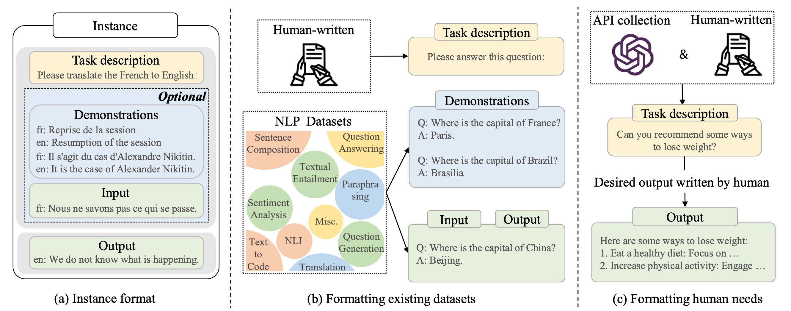

# 微调之前的准备

作为纯纯的软件工程师，我们发现：学懂基本的 AI Prompt 原理与模式，不懂 LLM （大语言模型）算法，你也可以轻易驾驭 LoRA （Low-Rank
Adaptation of LLM，即插件式的微调）训练。

我和我的同事 [@tianweiliu](https://github.com/tianweiliu) 分别对 Meta 公司开源的 LLaMA 和清华大学开源的 GLM 进行 LoRA
训练。 在花费了上千元（成本主要在 OpenAI API 调用和云 GPU —— 感谢 **AIOS club** 和 **OpenBayes 赞助**）
的云费用之后，我们训练了 3 个 Lora：详细需求（用户故事）生成（**3k 数据**）、测试代码生成（**8k 数据**）、代码生成（**20k 数据**）。

仅就结论来说：LoRA 毫无疑问可以满足大部分的需求，特别是可以解决跨部门的数据共享问题。但是，考虑到数据的 **
GIGO（垃圾进，垃圾出）**的基本现象，**如何构建高质量的数据是一大挑战？**

## Instruction 的设计

通常，格式化的指令（Instruction）由以四个部分组成：

- 任务描述（称为指令）：描述模型需要完成的任务及其背景信息。
- 输入：指示模型应该接收哪些输入数据。
- 对应输出：对于给定的输入，指示模型应该输出什么结果。
- 少量演示（可选）：提供一些示例输入和对应的输出，以帮助模型更好地理解任务。

诸如于：

```json
{
  "instruction": "给定两个数字，计算它们的和。",
  "input": "1, 2",
  "output": "3"
}
```



上图出自：《[A Survey of Large Language Models](https://arxiv.org/abs/2303.18223)》

## Unit Mesh AI 辅助编程的试验

对于 LoRA 和 Prompt 来说，工程师完全可以把 LLM（大语言模型） 当成黑盒，当成一个函数，反正现阶段的 AI
专家也无法解释：为什么这样的输入会产出这样的结果。

所以，我们只需要**提供对输入**，就会**产出对应的输出**。而要提供这样的机制，则需要软件开发流程足够的标准化。

Unit Mesh （[https://github.com/unit-mesh](https://github.com/unit-mesh)） 是我们思考和设计的适合于 AI 编程的架构范式。在设计
LoRA 训练的初期，我们考虑的是实现先复现 ChatGPT + ChatFlow 的设计场景：

1. **需求细化**。AI 辅助将模糊的需求转变为的需求设计，比如 “注册” 功能，生成为：”作为一个用户 xxx，填入用户名、密码信息等等，接着由人类去检查和完善。
2. **代码生成**。AI 辅助将详细的需求设计翻译为目标的代码，再接着由人类去检查和完善。
3. **测试生成**。AI 辅助根据生成的代码生成对应的测试代码，再接着由人类去检查和完善。

最后，只需要确保生成的代码是可以像代码单元运行，那么就可以用来作为 AI 编程的 Copilot。

于是，在三个 LoRA 里，我们使用非常简单的 instruct，并尽可能提供，以便于集成到工具中使用。如下：

- 需求细化。instruction：create Agile user story for following topic，input：功能的基本信息
- 代码生成。instruction：Implement the method xxx，input：类的基本信息
- 测试生成。instruction：Write test for follow code，input：类的基本信息

从测试结果来看，随着数据量的增多，比如 20000 个代码用例比 10000 个代码用例更加的 “聪明”。

同样的，对于需求细化或者测试代码生成来说，也是如此。

## 数据的挑战：标准化流程 + 规范化 + 丰富的数据

所以，在有了上述的经验之后，就会发现 LLM 的 Lora 训练并不是我们的难点，我们要面向的主要挑战是：标准化流程 + 规范化 + 丰富的数据。

### 挑战  1：**标准化流程**

在上述的 Unit Mesh 试验里，为了训练的结果更加准确，我们详细拆分了软件开发的步骤，以确保每一步生成的是准确，进而驱动出准确的结果。如下是我们拆分的一小部分细流程的示例：

- design_restful_api
- design_plantuml_java_datastructure
- implementation_spring_controller
- implementation_controller_test
- implementation_spring_service
- ….

我们需要拆分到每一个尽可能小的步骤，在每一个细化的步骤里，喂入数据，才会让 AI 产生最大的复读机效果。

### 挑战  2：**规范化**

在代码生成的第一版本 10000 个数据的 LoRA 里，我们先测试了一个简单的 Blog API 生成：

```java
@RestController
@RequestMapping("/blog")
public class PostController {

    @Autowired
    private BlogService blogService;

    @RequestMapping(value = "/createPost", method = RequestMethod.POST)
    @ResponseBody
    public BlogPostDto createPost(@RequestBody BlogPostDto blogPostDto) {
        BlogPost blogPost = blogService.createPost(blogPostDto);
        return new BlogPostDto(blogPost.getId(), blogPost.getTitle(), blogPost.getContent());
    }
}
```

这里生成的 URI 是 `createPost` 不符合 RESTful 规范，而后我们提升到了 20000 个数据之后，这个问题解决了。从模式上来说，LLM
会学习大部分的习惯，好习惯会留下来，坏习惯也会被继承。也因此，**一旦源数据的代码、需求说明不规范**，**那么训练出来的数据就会有问题
**。也就是所谓的垃圾进、垃圾出。

### 挑战 3：丰富的数据

在需求细化的 LoRA 里，我们通过 OpenAI 的 Davinci 模型，分解了 186 个场景下的应用，进而训练了 3400+ 的用户故事（穷 +
无底洞，所以量级少一点）。在这个 LoRA 里，我们可以输入一个简单的需求，由 AI 帮我们细化详细的需求。仅从训练完的结果来看，LoRA
能符合我们的需要 —— 提供低成本的 LLM 定制。

不过呢，与 ChatGPT 相比依旧存在一些问题：**源数据缺少丰富的多 AC 场景，导致写出来的 AC 数量较少**。

如下是清华大学的 ChatGLM 训练完后返回的结果：

```kotlin
Instruction: create user story tasks
Input: 购买电影票
Output:

用户故事:可以购买电影票
作为一个电影票购买者
我想在应用中购买电影票
以便于我可以在电影院观看电影

AC 1: 电影票购买者可以在应用中购买电影票
假设 电影票购买者已经登录了应用
当 电影票购买者点击购买电影票按钮
于是 电影票购买者可以查看电影院的可用座位,选择座位,支付电影票,查看电影票的详细信息
```

对应的 Meta（Facebook） 的 Llama 训练完后返回的结果：

```kotlin
Instruction: create Agile user story for following toic
Input: Log in to the account
Output:

用户故事:可以注册账号作为一个社交网站用户
我想在 社交网站注册账号
以便于 我可以使用社交网站的功能

AC 1: 用户可以在社交网站注册账号
假设 用户已经登录社交网站
当 用户点击“注册账号”按钮
于是 用户可以在社交网站注册账号

AC 2: 用户可以在社交网站注册账号
假设 用户已经登录社交网站，并且已经注册账号
当 用户点击“更换账号”按钮
于是 用户可以在社交网站更换账号
```

## 使用插件式的 LoRA，企业应该准备什么？

诚然 LLM 的变化特别快，大部分企业可能在观望，但是我们建议从现在开始准备数据。由于通用的大模型无法解决特定领域的编程问题，所以对于大部分组织来说，依旧可以准备着手训练
LoRA —— 可以在整个组织使用，又或者是跨部门使用。

对于编程部分，诸如以下的场景是需要考虑的问题：

- 私有的基础设施。大部分企业都会采用自研的云平台，这些云平台过去的主要问题挑战是**文档不详细、API 版本不对**，未来在采用 AI
  辅助编程时，这些基础设施也将会成为新的挑战。
- 框架、库。相似的，除了组织内部的库，三方提供的框架和库也应该提供对应的**三方 LoRA**。
- 领域特定语言。众所周知，大部分组织可能购买了一些领域特定的系统或者语言，它们也需要准备好对应的数据，

除此，可能还存在其它一些场景，如与**LLM + 低代码系统的集成**。

### 1. 高质量的脱敏数据

数据是训练 LoRA 的关键，但是为了保护企业的知识产权和数据安全，需要对数据进行脱敏处理。因此，企业需要准备足够数量和高质量的脱敏数据，以确保训练出来的模型具有较高的准确性和可靠性。

> 诸如于，回到我们的训练过程里，由于早期我们投喂的数据量比较低，所以有很大的概率出现了：**50% 左右的源代码输出**
> 。简单来说，你写了一个加密模块，使用了同样的输入和输出，就可能可以从大模型出原样拷贝出来。就这一点而言，它是相当可怕的。
>

在生成脱敏数据时，企业需要考虑许多因素，例如数据的分布、样本的数量、数据的多样性、数据的质量等等。同时，企业也需要采取适当的措施来确保生成的数据的质量和可靠性。这可能包括采用自动化工具、进行数据质量控制、进行人工审核等等。

### 2. 工程化的数据准备

对于通用的 LoRA 训练来说，通常我们采用的是下面的格式来训练：

```java
{
  "instruction":"Implement the method xxx",
  "input":"类信息",
  "output":"函数的代码"
}
```

为了得到这样的结果，还需要对数据进行治理，以确保数据的准确性、一致性和可用性。这包括数据采集、存储、清洗、预处理和管理等方面。如我们在写
Unit Mesh 的一系列 LoRA 时，编写了几个工具：

- 数据采集。GitHub Crawler 模块，作用你懂的。
- 数据清洗、数据预处理。使用 Kotlin 编写了 Unit Processors 模块，用来对代码进行处理；使用 Python 编写了 Unit Prompter 模块，用来对
  OpenAI 进行处理。
- 数据管理。数据量不大，主要采用的是 jsonl 格式在 GitHub 上存储数据。

其中最复杂的部分是 processor，需要对各类数据进行处理。

### 3. 规范与流程标准化

当企业使用插件式的 LoRA 进行编程时，为了保证编程的效率和质量，需要对编程流程进行规范化和标准化，以确保使用 LoRA
的效率和质量。包括了以下几个方面：

1. 制定编程规范：制定编程规范是确保代码风格一致性和可读性的重要措施。编程规范可以包括命名规范、注释规范、代码格式规范等。
2. 标准化代码风格：编程风格的标准化可以提高代码的可读性，降低代码的复杂性和维护成本。在使用 LoRA 进行编程时，应采用标准化的代码风格，以便
   LoRA 更好地理解代码。
3. 版本控制：版本控制是管理代码变更的一种方法，可以追踪代码的变更历史、协作开发等。在使用 LoRA 进行编程时，应该使用版本控制工具，如
   Git 等。
4. 代码审查：代码审查是一种确保代码质量的方法，可以通过代码审查来发现代码中的错误和缺陷。在使用 LoRA
   进行编程时，应该进行代码审查，以确保代码的质量和可读性。

这时，我们就需要采用一些合适的工具来对现有的代码和架构进行治理，如我们开发的开源架构治理工具
ArchGuard （[https://github.com/archguard/](https://github.com/archguard/)）。
