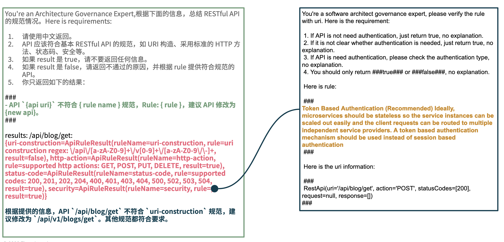

# LLM 架构设计原则：原子能力映射

在 ArchGuard Co-mate 中，对于 API 能力来说，我们做的一件事是**分解 API 文档**， **按不同 LLM 的原子能力进行分解**。构建出四种不同的原子能力：

- 推理出适用于 URI 的正则表达式。
- 推理出一个合理的 example。
- 提取一些 checklist，诸如于状态码、HTTP Action 等。
- 将剩下的不确定性内容，扔到一起。

如下图所示：


比如说，在 Co-mate 的 REST API 治理场景下，我们使用的 LLM 能力包括了：

- 分类：让 LLM 分析 API 文档，让我们后续根据 URI、HTTP Action、安全等几个不同的能力维度来选择适合的工具。
- 逻辑推理：让 LLM 分析 API 文档的 URI Construction 部分，生成用于检查的 URI 正则表达式部分，以及适合于人类阅读的 by example 部分。当然了，也包含了其它场景之下的推理。
- 提取：由 LLM 按 API 规范的不同维度来提取一些关键信息。
- 分类：由 LLM 来总结哪些部分难以简单的通过代码总结，诸如于安全等不适合于所有的 API 场景。
- ……

由此构成了 “能力映射” 的左图部分，这种方式适用于不同的规范分解。尽管如此，对于当前方式来说，依然还有一系列的可优化的空间，诸如于对 security、misc 进行进一步的能力分解。

在右侧，我们则构建了一个 Kotlin Typesafe DSL，以动态的加载到系统中（未来），每一个函数对应到一个 Rule。

```kotlin
rest_api {
    uri_construction {
        rule("/api\\/[a-zA-Z0-9]+\\/v[0-9]+\\/[a-zA-Z0-9\\/\\-]+")
        example("/api/petstore/v1/pets/dogs")
    }

    http_action("GET", "POST", "PUT", "DELETE")
    status_code(200, 201, 202, 204, 400, 401, 403, 404, 500, 502, 503, 504)

    security("""Token Based Authentication (Recommended) Ideally, ...""")

    misc("""....""")
}
```

作为一个 demo，这个 DSL 依旧具备很大的完善空间。其中比较有意思的部分在于 security 和 misc 部分，这些不确定性正好适用于 LLM 进行推理。所以，在执行对应的 misc、security 规则检查时，会再调用  GPT 来检查：



以将其中的确定性与不确定性更好的结合，进而充分地利用了 LLM 与 ArchGuard 的能力，并减少对 GPT 的消耗。
